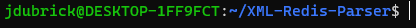
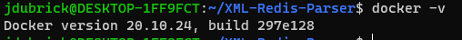
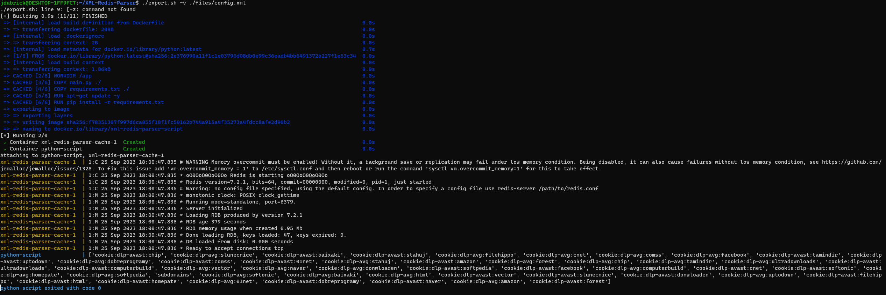

# XML-Redis-Parser

## Description

This script parses an XML file and exports the data to Redis. The Python script and Redis server run with the help of docker-compose and the overall application is accessed through a shell script.

## Usage

To use this application ensure you have the following on your machine:

- Docker
   
  With Docker installed navigate to the root directory of this project and ensure all .xml files are located in `./files`. To run the program execute `./export.sh -v './files/your_file_name.xml'`.

## Example

### Step 1:

Navigate to `./XML-REDIS-PARSER`

### Step 2:

Ensure Docker installed using `docker -v`

## Step 3:

Run `./export.sh -v ./files/config.xml`

### Step 4:

Observe output of all keys that are now in the Redis cache.

